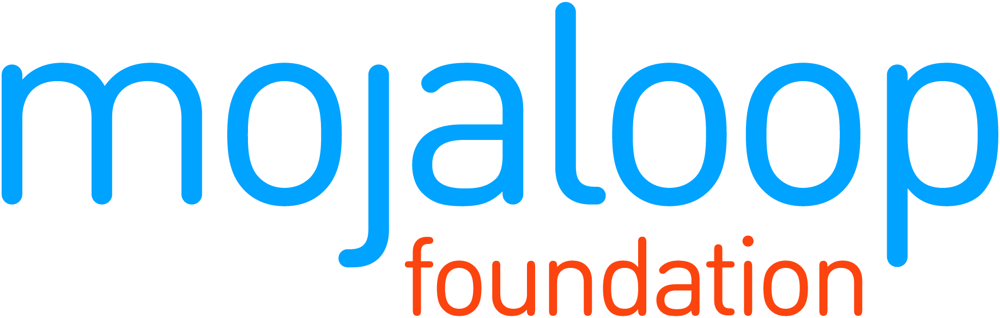
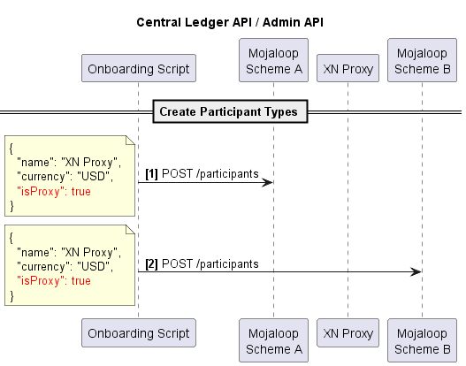
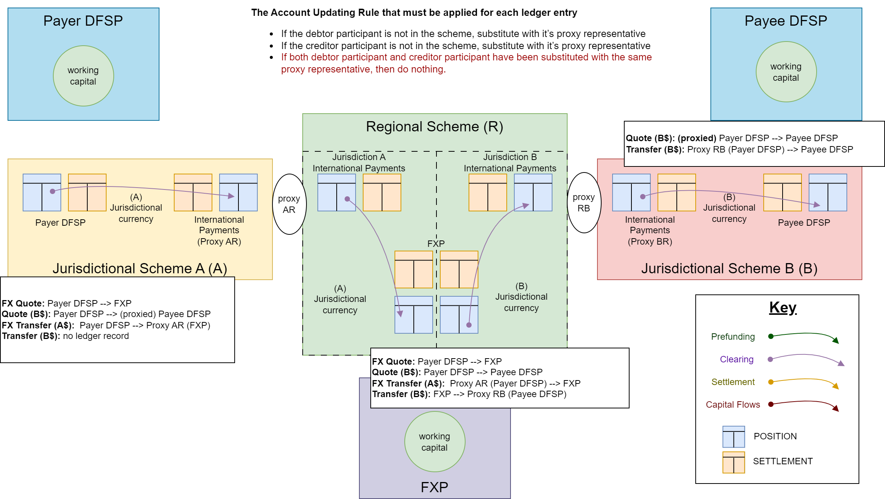

    
    
   
    
    

# Inter scheme using national switches Design
The proxy implementation method to connect schemes does the following.
1. Leverages the trust relationship between scheme so that a transaction only has a single pre-funding requirement at the Payer's scheme.
2. Ensures non-repudiation across schemes; removing the requirement for the cross-network proxy to take on responsibility for clearing; which removes costs

The schemes are connected via a proxy participant, that is registered to act as a proxy in the scheme for adjacent but connected dfsps in other schemes. 
Essentially, the two connected schemes behave as if they where a single scheme.

This design make the following assumptions
1. No two connected participant have the same identifier
1. Get \transfer request are resolved at the payee scheme
1. Timeouts in non-payee schemes are  disabled (maybe enlarged)

## General Patterns
There are certain general patterns that emerge
### Happy Path Patterns

### Error Patterns

<!-- 
## Detailed Designs
1. [Discovery - On Demand Implementation](./Discovery.md)
2. [P2P](./P2P.md)
-->
## Detailed Design of on Demand Discovery

The discovery flows are summarized as follows:
1. On Demand loading of cross network identifiers - using Oracles for identifier lookups in local scheme
2. On Demand loading for all identifiers

### On Demand Discovery using local oracles
- Scheme uses Oracles to map local identifiers to participants of the scheme
- Identifiers for other schemes are discovered via a depth first search, but asking all participants. Proxy participant then forward the request to the connected scheme
- This diagram shows two connected schemes, but this design work for any number of connected schemes.

### On Demand Discover with incorrectly cached results
- When an identifier moved to another dfsp provider, then the store cache for that participant will route to an unsuccessful get \parties call.

Here is a sequence diagram show how that gets updated.
#### Sequence Diagram

## P2P flow across network using Proxy
This design make the following assumptions
1. No two connected participant have the same identifier
1. No limit checks are done against proxy participants
1. Get \transfers request are resolved at the payee scheme
1. Timeouts in non-payee schemes are  disabled.

### Sequence Diagram
Here is a sequence diagram show the Agreement and Transfer stages of a transaction, and how the Get Transfer is resolved.

## Admin API - defining Proxy Participants

## Clearing Accounts for Inter-scheme FX transfers

