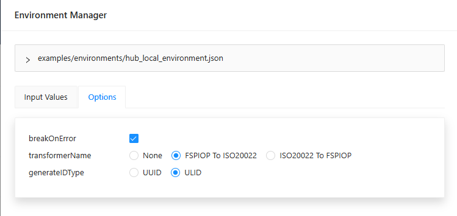

# Test Transfer Process

This guide outlines the process for sending test transfers to verify connectivity across three transfer types: Outbound Transfers, Inbound Transfers, and FXP Transfers. The steps include how to initiate transfers, check results, and troubleshoot failures using the Testing Toolkit (TTK).

---

## 1. Pre-requisites

- Mojaloop Testing Toolkit should be up and running, typically accessible at: `http://localhost:6060/admin/index`
- Ensure required test collection files (e.g., `payer-tests`, `payee-tests`, `fxp-tests`) are available locally or accessible via GitHub.
- For ISO 20022 tests, complete the [ISO 20022 Setup](#3-iso-20022-message-format-optional-configuration) first.

---

## 2. Test Execution Workflow

Follow these steps to execute transfer tests using the TTK:

1. **Open TTK Admin UI:**
   - Navigate to `http://localhost:6060/admin/index`

2. **Go to Test Runner:**
   - In the TTK Admin UI, select the Test Runner section from the left sidebar, or navigate directly to the Test Runner page at http://localhost:6060/admin/outbound_request.

   
   
3. **Click on Collection Manager:**
   - Open the test case selection panel via the *Collection Manager* button
   
   

4. **Import Test Collection:**
   - Use *Import File*, *Import Folder*, or *Import from GitHub* to load the test collection (e.g., `payer-tests`, `payee-tests`, `fxp-tests`)

5. **Select a Test Case File:**
   - Choose a relevant test case file based on the type of transfer you wish to validate (e.g., `outbound_transfer.json`, `p2p_happy_path.json`, `fxp_test.json`). Test case availability may vary.

6. **Execute Transfer Test(s):**
   - Click the *Run* button to execute selected tests

   

> 🔁 Action Required for ISO 20022 Tests: Complete the [ISO 20022 Setup](#3-iso-20022-message-format-optional-configuration) steps prior to test execution..

7. **Review Result Summary:**
   - Evaluate pass/fail status in the result summary
   - If failures occur:
     - Access the Monitoring section via the sidebar, or directly through `http://localhost:6060/admin/monitoring`
     - Alternatively, run `docker-compose logs mojaloop-testing-toolkit -f` to stream real-time logs for immediate diagnostics.

   

---

## 3. ISO 20022 Message Format (Optional Configuration)

If your test case leverages the ISO 20022 format, configure the transformer as follows:

### ISO 20022 Setup Steps

1. **Open Environment Manager:**
   - Click *Environment Manager* in the TTK UI

   

2. **Select Options Tab:**
   - Go to the *Options* tab inside Environment Manager

3. **Enable ISO Transformer:**
   - In *Transformer Name*, select `FSPIOP to ISO 20022`

   

> ⚠️ Ensure this configuration is applied before executing any ISO 20022-specific test case.

---

## 4. Troubleshooting Failures

- **Access Logs via UI:** Go to `Monitoring` in TTK sidebar
- **Access Logs via CLI:** Run `docker-compose logs mojaloop-testing-toolkit -f`
- **Review Failure Messages:** Cross-reference with test assertions and TTK logs

---

This guide provides a unified, scalable approach for validating Mojaloop connectivity across different transfer types using the TTK.

